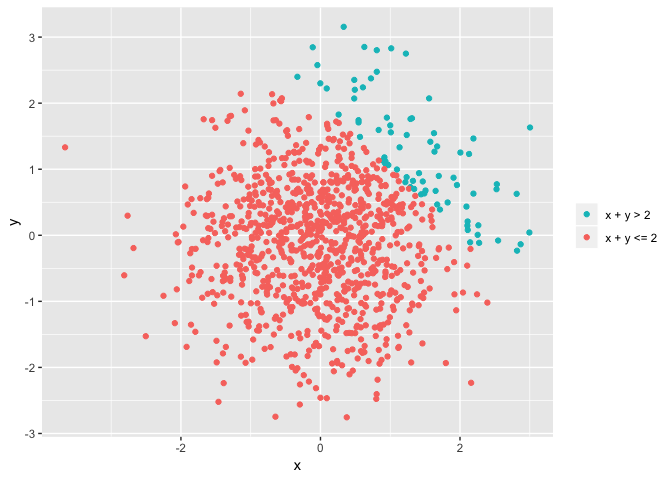
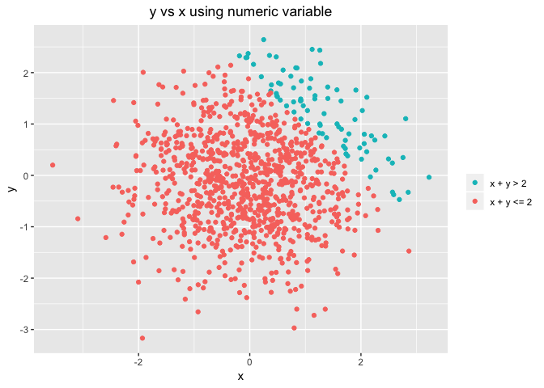
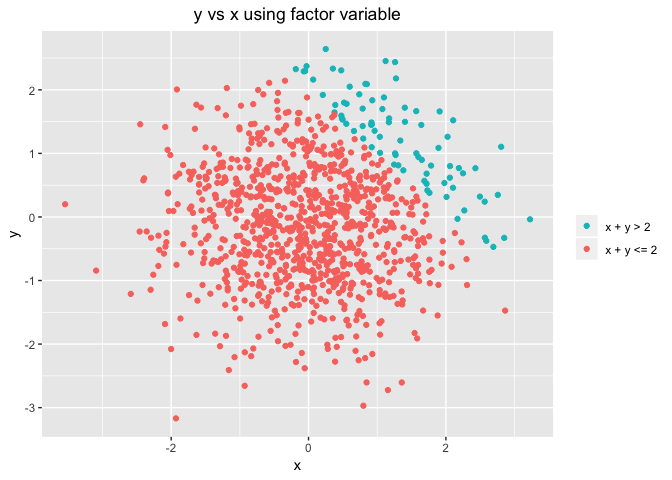

Homework 1
================
Kangkang Zhang
9/16/2018

Problem 1
---------

Create a dataframe comprised of four different vectors:

``` r
library(tidyverse)
```

``` r
df1 = tibble(
  vec_unif = runif(10,0,5),
  vec_logic = I(vec_unif > 2),
  vec_char =  letters[seq(1,10)],
  vec_factor = factor(c("up","down","up","down","up","down","up","down","up","down"))
)
```

The elements and their classes are shown below:

    ## # A tibble: 10 x 4
    ##    vec_unif vec_logic vec_char vec_factor
    ##       <dbl> <I(lgl)>  <chr>    <fct>     
    ##  1   4.92   TRUE      a        up        
    ##  2   1.95   FALSE     b        down      
    ##  3   1.17   FALSE     c        up        
    ##  4   1.25   FALSE     d        down      
    ##  5   1.40   FALSE     e        up        
    ##  6   0.428  FALSE     f        down      
    ##  7   3.34   TRUE      g        up        
    ##  8   4.81   TRUE      h        down      
    ##  9   0.0639 FALSE     i        up        
    ## 10   2.96   TRUE      j        down

------------------------------------------------------------------------

Caculate mean of each variable in the dataframe:

``` r
mean_unif = mean(df1$vec_unif)
mean_logic = mean(df1$vec_logic)
mean_char = mean(df1$vec_char)
mean_factor = mean(df1$vec_factor)
```

Generate a table of each mean value:

| Variable  | Mean      |
|-----------|-----------|
| uniform   | 2.2288979 |
| indicator | 0.4       |
| character | NA        |
| factor    | NA        |

**Answer**: Uniform sample and logical vector work, while character vector and factor vector do not work.

-   Uniform sample are Real number which can be calculated.

-   As for indicator variable, 1 represents TRUE and 0 represents FALSE. When indicator variable are being calculated, the numeric value is used.

-   Character variable and factor variable are both nominal variables, it is meaningless to calculate their means.

------------------------------------------------------------------------

Convert character and factor variable to numeric:

``` r
as.numeric(df1$vec_char)
as.numeric((df1$vec_factor))
```

**Result**: Charactor variable turned to be NA, while factor varible successfully converted to numeric variable.

``` r
as.numeric(as.factor(df1$vec_char))
```

    ##  [1]  1  2  3  4  5  6  7  8  9 10

``` r
as.numeric(as.character(df1$vec_logic))
```

    ##  [1] NA NA NA NA NA NA NA NA NA NA

**Result**: Character variable successfully convertd to numeric variable in the end, while factor variable failed. We can say that charactor variable cannot convert to numeric variable directly, while factor variable could.

Problem 2
---------

Create a dataframe comprised of five different vectors:

``` r
df2 = tibble(
  x = rnorm(1000),
  y = rnorm(1000),
  vec_logic = I(x + y > 2),
  vec_num =  as.numeric(I(x + y > 2)),
  vec_factor = as.factor(I(x + y > 2))
)
```

------------------------------------------------------------------------

**description**:

-   the size of the dataset: 1000, 5

-   mean of x: -0.0194108

-   the proportion of cases for which the logical vector is `TRUE`: 0.071

------------------------------------------------------------------------

Draw scatterplot of y vs x whose color points use the **logical variable**:

``` r
ggplot(df2, aes(x, y)) + 
  geom_point(aes(colour = factor(df2$vec_logic))) + 
  ggtitle("y vs x using logical variable") +  
  theme(plot.title = element_text(hjust=0.5)) + 
  scale_colour_discrete(name = NULL, guide = guide_legend(reverse=TRUE), labels = c('x + y <= 2','x + y > 2'))
```



Save the first plot with ggsave.

------------------------------------------------------------------------

Draw scatterplot of y vs x whose color points use the **numeric variable**:

``` r
ggplot(df2, aes(x, y)) + 
  geom_point(aes(colour = factor(df2$vec_num))) + 
  ggtitle("y vs x using numeric variable") +  
  theme(plot.title = element_text(hjust=0.5)) + 
  scale_colour_discrete(name = NULL, guide = guide_legend(reverse=TRUE), labels = c('x + y <= 2','x + y > 2'))
```



------------------------------------------------------------------------

Draw scatterplot of y vs x whose color points use the **factor variable**:

``` r
ggplot(df2, aes(x, y)) + 
  geom_point(aes(colour = factor(df2$vec_factor))) + 
  ggtitle("y vs x using factor variable") +  
  theme(plot.title = element_text(hjust=0.5)) + 
  scale_colour_discrete(name = NULL, guide = guide_legend(reverse=TRUE), labels = c('x + y <= 2','x + y > 2'))
```



**Comment**: The color scales are the same among the three scatterplots. When we were converting logical vector into numeric vector or factor vector, samples which had same logical value would still have the same numeric value or factor value. So the scatterplots should look the same.
